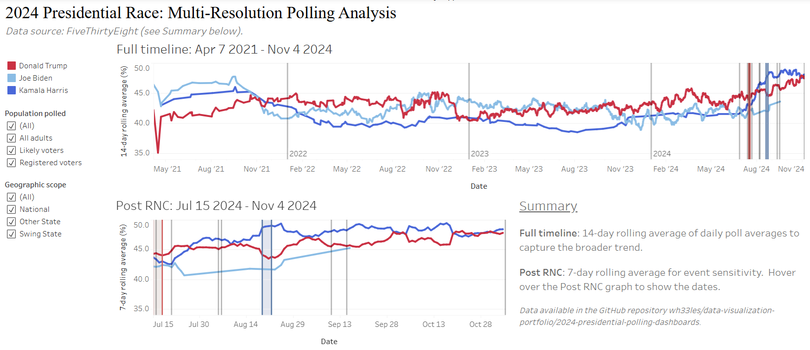

# 2024 Presidential Polling Dashboards

This data engineering and visualization project is a collection of interactive dashboards visualizing polling data from the 2024 U.S. presidential election. Built in Tableau, the dashboards allow users to explore trends by state, party, and polling source.  Contains advanced data pipeline development using Python, statistical analysis, and interactive dashboard creation.

## Source Data

Data was available at FiveThirtyEight during the election season.  A copy of it, called `president_polls.csv`, is in the `data` directory.  Includes data from nearly 4,000 polls dating from April 7 2021 to November 4 2024.  Check out `data_exploration.ipynb` for data exploration.

## Live demos

- [2024 presidential race: multi-resolution polling analysis](https://public.tableau.com/app/profile/ashley.k.w.warren/viz/rolling-polling-trends/2024PresidentialRaceMulti-ResolutionPollingAnalysis?publish=yes)  Rolling averages for the candidates Trump, Biden, and Harris.  Key campaign events highlighted.  Toggle between populations sampled and geographic scopes.

<p align="center">

</p>

- Stay tuned for more!

## Features

This data science portfolio project transforms raw polling data into interactive visualizations, featuring:

- Automated data cleaning pipeline with Python
- Advanced feature engineering for polling analysis
- Statistical calculations including margin of error and confidence intervals
- Interactive Tableau dashboards with filtering and time-series analysis

##  Technology Stack

### Data Processing & Analysis

- Python 3.8+ - Core data processing
- Pandas - Data manipulation and analysis
- NumPy - Numerical computations
- SciPy - Statistical calculations

### Data Visualization

- Tableau Desktop/Public - Interactive dashboards
- Matplotlib/Seaborn - Statistical plotting 

### Data Engineering

- Modular Python pipeline - Scalable processing architecture
- Logging & debugging - Professional error handling
- CSV data management - Structured data workflows

## Usage Guide

### Setup

Create and activate a virtual environment and install `requirements.txt` before proceding.

### Standard Processing
```bash
cd processing-pipeline-files
python main.py 
```

### Debug Mode (Detailed Logging)
```bash
cd processing-pipeline-files
python main.py --debug
```

The default file for input is `../data/president_polls.csv`. 

### Output

- `data/cleaned_polling_data.csv` - Analysis-ready dataset
- `processing-pipeline-files/polling_data_pipeline.log` - Processing logs and statistics

## Future Enhancements

### Advanced Dashboard Visualizations

- Momentum Indicator Heat Map - Monthly polling changes by candidate
- Pollster Quality Scatter Plot - Sample size vs polling spread correlation
- Methodology Impact Box Plots - Results distribution by polling method
- Geographic Heat Maps - State-by-state polling visualization

### Statistical Analysis Improvements

- Sample-size weighted averages - Quality-adjusted polling trends
- Polling volatility indicators - Standard deviation tracking over time
- Confidence interval bands - Visual uncertainty representation
- Rolling average comparisons - 7-day vs 14-day trend analysis
- Key event impact analysis - Before/after polling shifts

### Technical Infrastructure

- Database integration - PostgreSQL for larger datasets
- API development - Polling data endpoints
- Docker containerization - Reproducible deployment environment

## Contact & Collaboration

**Interested in data science collaboration or have questions about this project?**

- **Email**: [ashleykwwarren@gmail.com]
- **LinkedIn**: [Ashley K. W. Warren](https://www.linkedin.com/in/ashleykwwarren/)

---

## Keywords

`data science` `machine learning engineering` `polling analysis` `python data pipeline` `tableau dashboard` `feature engineering` `statistical analysis` `data visualization` `presidential election` `political data` `data cleaning` `portfolio project` `interactive dashboard` `time series analysis` `polling methodology` `margin of error` `confidence intervals` `data quality` `electoral analysis`

---
